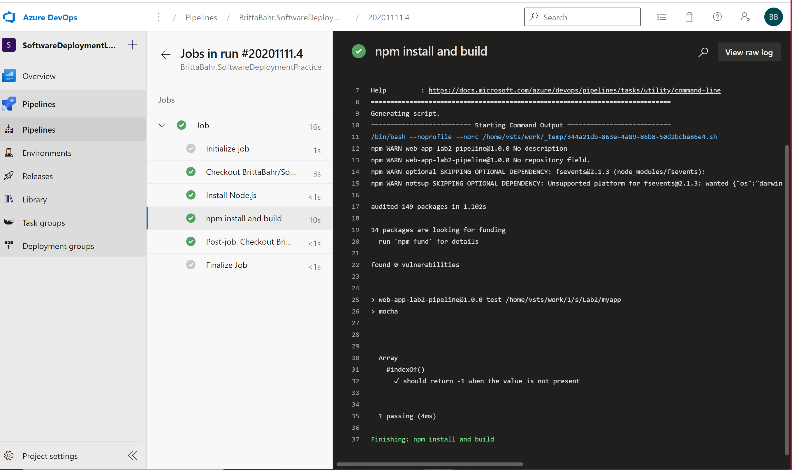
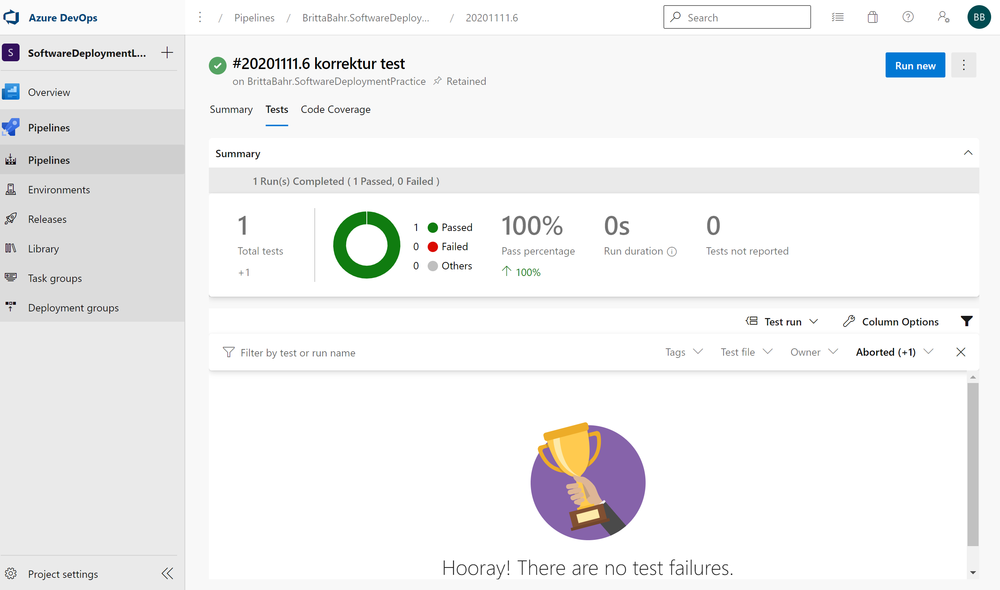
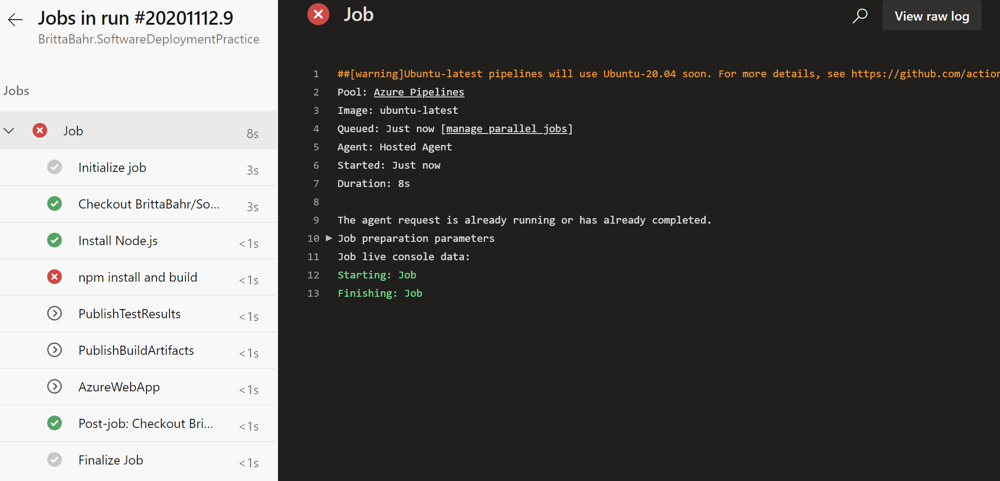
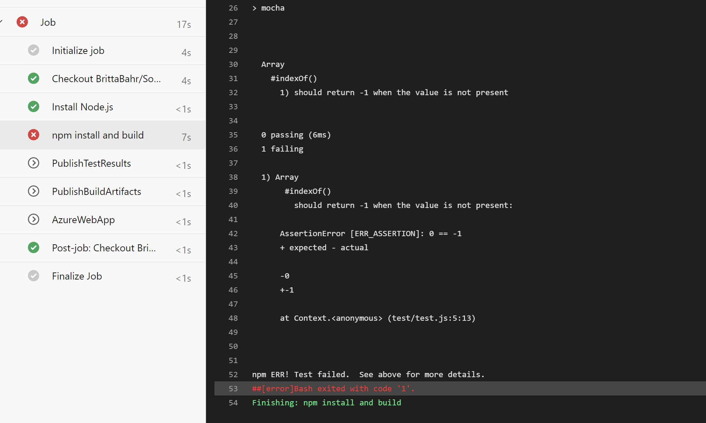
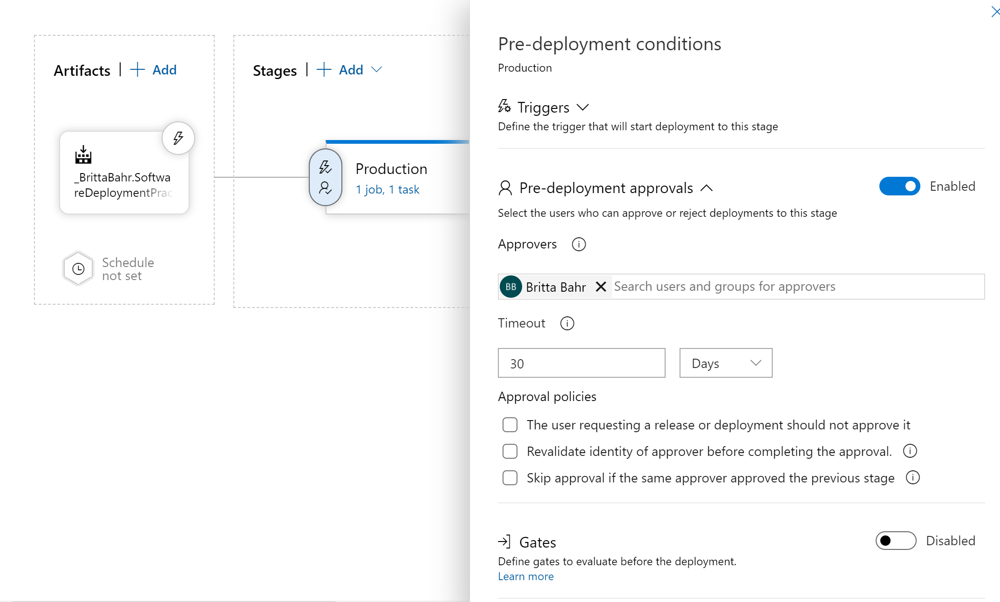
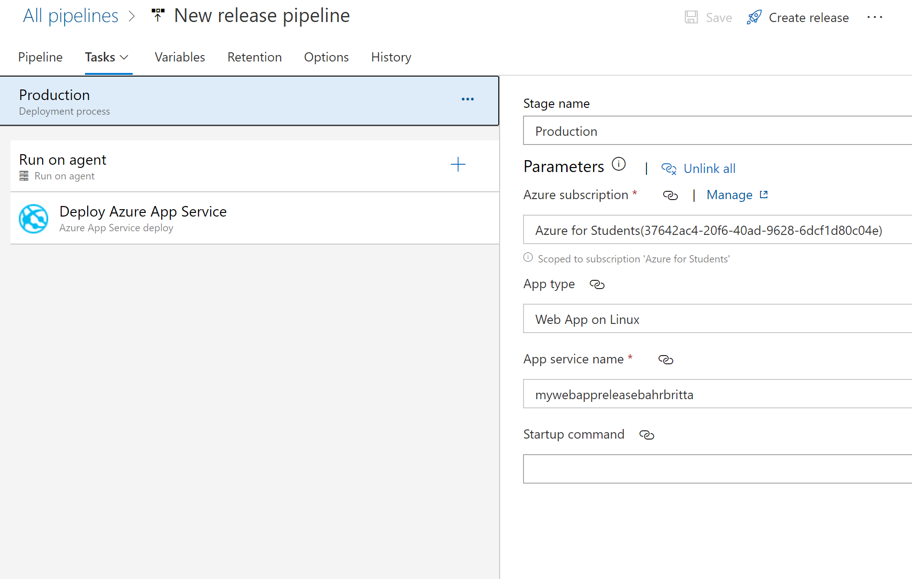
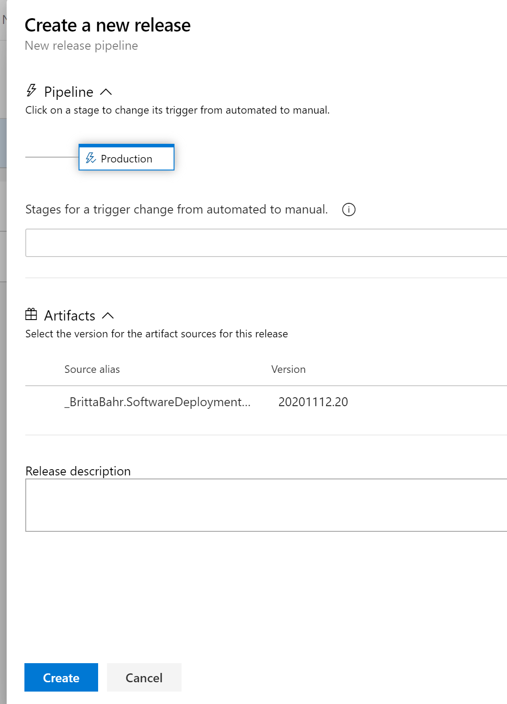
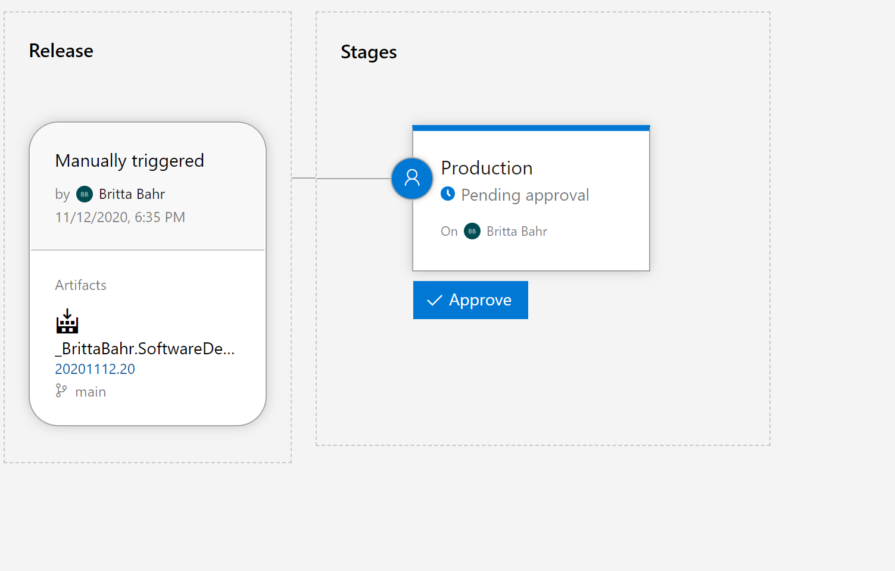
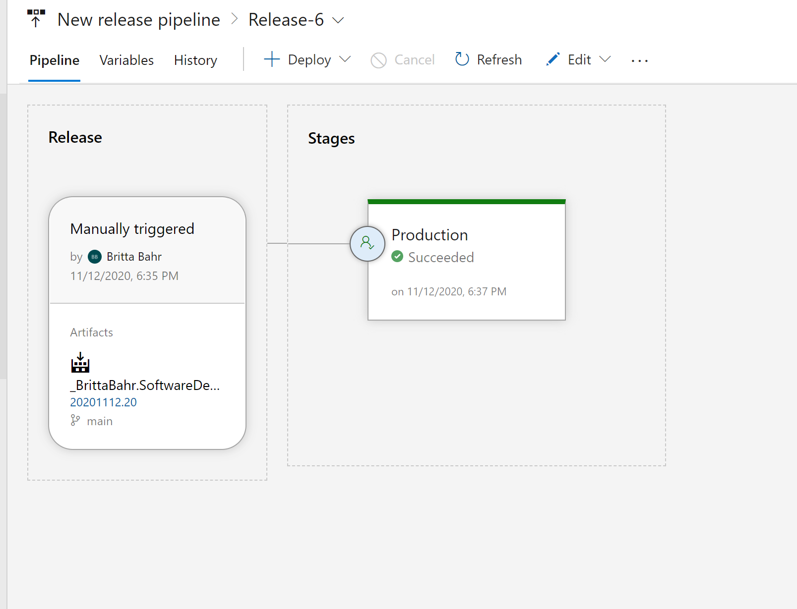
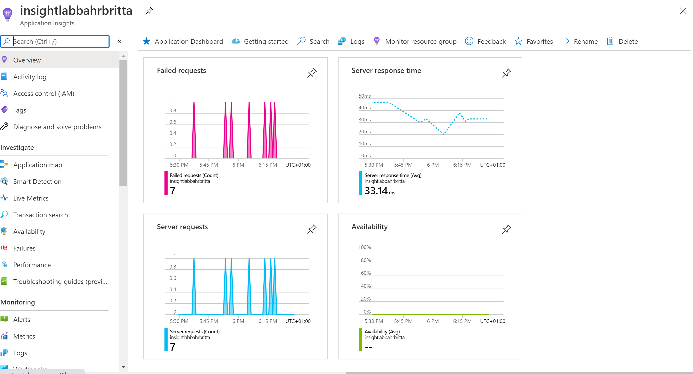

## Links zu Azure Web App:

dev: https://mywebappbahr.azurewebsites.net

production: https://mywebappreleasebahrbritta.azurewebsites.net

## Schreenshot der Azure DevOps build/Test/Deploy Pipeline

erfolgreiches Deployment: 

 

 erfolgreicher Test: 

 

Deployment ist fehlgeschlagen:

 

Test ist fehlgeschlagen: 

 

## Schreenshot der Azure DevOps Release Pipeline

 

  

## Dokumentation Release: 

Einen neuen Release erzeugen: 

 

Dannach müssen wir den Release bestätigen: 

 

 Dannach ist der Release erfolgreich: 

  

## Application Insights
Meine Deployment web app ist mit Application Insights verbunden: 

 